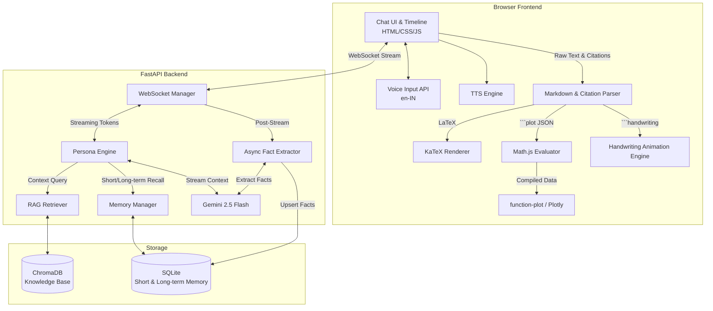

# Design Decisions & Approach

This document outlines the core architectural and design decisions behind the Ramanujan Digital Twin, specifically detailing our approach to the persona, system architecture, and interactive visualizations.

## System Architecture Diagram



## 1. Persona & Historical Authenticity
- **Decision**: Restrict the LLM's knowledge base and temporal awareness to events and mathematics strictly prior to April 1920.
- **Rationale**: To create a true "Digital Twin," the persona must be historically accurate. We rely heavily on a Retrieval-Augmented Generation (RAG) pipeline fed exclusively with Ramanujan's actual notebooks, letters to G.H. Hardy, and published papers. The system prompt enforces his spiritual connection to mathematics (the Goddess Namagiri) and his humble, slightly formal early 20th-century vernacular.

## 2. Real-Time Streaming Architecture
- **Decision**: Use FastAPI with WebSockets for the chat interface instead of standard REST endpoints.
- **Rationale**: LLM generation, especially when fetching RAG context and synthesizing complex mathematical formulas, can be time-consuming. WebSockets allow us to stream Gemini's response token-by-token directly to the client. This dramatically reduces perceived latency and creates a natural, typing-like conversational flow.

## 3. Mathematical Rendering (KaTeX)
- **Decision**: Use KaTeX instead of MathJax for rendering LaTeX formulas on the frontend.
- **Rationale**: KaTeX is significantly faster than MathJax and renders synchronously, preventing layout shifts and making it much more suitable for real-time streaming text where equations are constantly being appended to the DOM.

## 4. Interactive Graphing (2D & 3D Visualizations)
- **Decision**: Offload data generation to the client using `Math.js` + `Plotly.js` / `function-plot`, rather than having the LLM generate raw data points.
- **Rationale**: 
  - **Token Efficiency**: Asking an LLM to generate hundreds of $(x, y, z)$ coordinates for a 3D surface mesh would consume thousands of tokens, increasing latency and cost, while also risking hallucinated or malformed JSON output.
  - **The Approach**: We instruct the LLM to simply output the mathematical function as a string (e.g., `sin(x) * cos(y)`) wrapped in a lightweight JSON configuration inside a custom ````plot```` or ````plot3d```` markdown block.
  - **Execution**: The browser captures this block, uses `Math.js` to locally parse and evaluate the mathematical expression over a grid, and then passes the resulting data array to `Plotly.js` or `function-plot`. This allows lightning-fast, high-resolution, interactive charts with virtually zero LLM overhead.

## 5. Unified Content Rendering Pipeline
- **Decision**: Process custom markdown blocks (like ````plot````) *before* standard text parsing and HTML escaping.
- **Rationale**: Standard markdown parsers will aggressively escape characters like `"` to `&quot;`, which breaks JSON parsers. By extracting our custom JSON blocks into temporary DOM placeholders *first*, we protect the configuration data. Once the text is safely converted to HTML and the math is rendered by KaTeX, we reinject the interactive graphs into their respective placeholders.

## 6. Dual-Tier Persistent Memory System
- **Decision**: Implement a two-tiered memory architecture consisting of short-term conversational context and an asynchronous long-term fact extractor.
- **Rationale**: Passing the entire chat history constantly to the LLM consumes tokens and dilutes the context window. Instead, we keep a sliding window for immediate chat turns. Concurrently, an asynchronous background task queries the LLM to extract key long-term facts (e.g., the user's name, their mathematical proficiency, topics of interest) into a SQLite database. These facts are then prepended to the system prompt in future sessions, enabling cross-session personalization without the overhead of massive context windows.

## 7. Dynamic Handwriting Animation Engine
- **Decision**: Render certain complex mathematical responses via an HTML5 canvas animation to simulate authentic human handwriting, rather than just displaying static text.
- **Rationale**: To enhance the "Digital Twin" illusion, Ramanujan dynamically "writes" out his thoughts on a simulated vintage graph paper canvas. By utilizing the `Caveat` font and programmatically applying micro-jitters to character coordinates, slight rotational slants, and variable drawing speeds, we create a highly realistic, progressive visual representation of his mathematical process that avoids the sterile look of standard typographic math rendering.

## 8. Voice Interaction & Auditory Feedback
- **Decision**: Integrate browser-native `SpeechRecognition` and `SpeechSynthesis` APIs natively tuned to Indian-English (`en-IN`).
- **Rationale**: Ramanujan's spoken dialogue allows a more immersive, multi-modal interaction. Using continuous listening mode with interim results provides a fluid, hands-free experience while exploring mathematical queries.

## 9. Interactive Inline Source Citations
- **Decision**: Embed interactive, expandable source tooltips directly within the chat interface for RAG-retrieved documents.
- **Rationale**: Given the educational nature of the project, responses must be verifiable. Rather than simply citing "Source 1", the frontend parses citation tags and attaches hoverable tooltips containing the exact historical excerpts from Ramanujan's notebooks or letters, complete with direct external links (e.g., to the Internet Archive), maintaining academic rigor while preserving clean chat UI.
