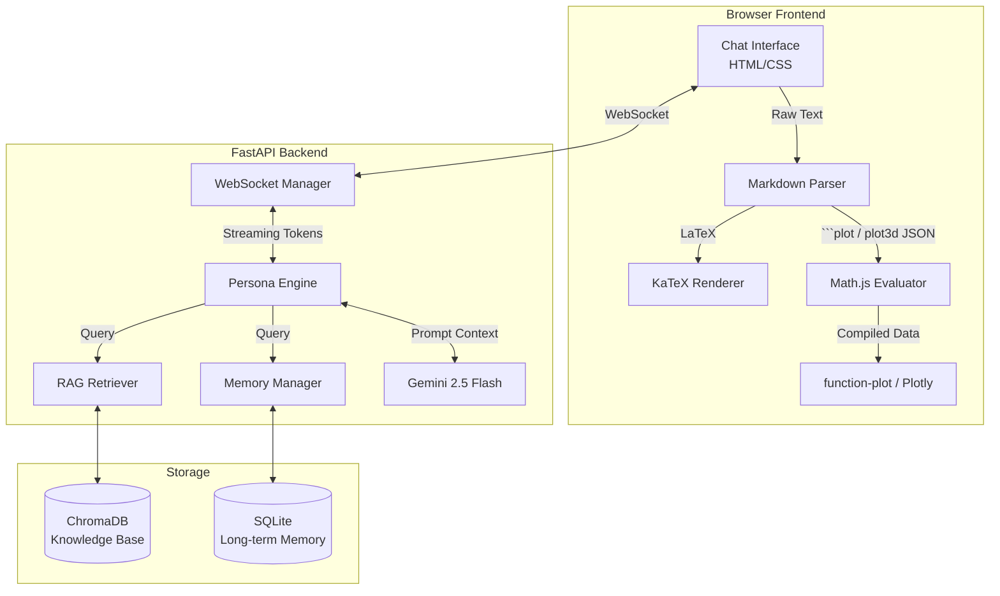

# Design Decisions & Approach

This document outlines the core architectural and design decisions behind the Ramanujan Digital Twin, specifically detailing our approach to the persona, system architecture, and interactive visualizations.

## System Architecture Diagram



## 1. Persona & Historical Authenticity
- **Decision**: Restrict the LLM's knowledge base and temporal awareness to events and mathematics strictly prior to April 1920.
- **Rationale**: To create a true "Digital Twin," the persona must be historically accurate. We rely heavily on a Retrieval-Augmented Generation (RAG) pipeline fed exclusively with Ramanujan's actual notebooks, letters to G.H. Hardy, and published papers. The system prompt enforces his spiritual connection to mathematics (the Goddess Namagiri) and his humble, slightly formal early 20th-century vernacular.

## 2. Real-Time Streaming Architecture
- **Decision**: Use FastAPI with WebSockets for the chat interface instead of standard REST endpoints.
- **Rationale**: LLM generation, especially when fetching RAG context and synthesizing complex mathematical formulas, can be time-consuming. WebSockets allow us to stream Gemini's response token-by-token directly to the client. This dramatically reduces perceived latency and creates a natural, typing-like conversational flow.

## 3. Mathematical Rendering (KaTeX)
- **Decision**: Use KaTeX instead of MathJax for rendering LaTeX formulas on the frontend.
- **Rationale**: KaTeX is significantly faster than MathJax and renders synchronously, preventing layout shifts and making it much more suitable for real-time streaming text where equations are constantly being appended to the DOM.

## 4. Interactive Graphing (2D & 3D Visualizations)
- **Decision**: Offload data generation to the client using `Math.js` + `Plotly.js` / `function-plot`, rather than having the LLM generate raw data points.
- **Rationale**: 
  - **Token Efficiency**: Asking an LLM to generate hundreds of $(x, y, z)$ coordinates for a 3D surface mesh would consume thousands of tokens, increasing latency and cost, while also risking hallucinated or malformed JSON output.
  - **The Approach**: We instruct the LLM to simply output the mathematical function as a string (e.g., `sin(x) * cos(y)`) wrapped in a lightweight JSON configuration inside a custom ````plot```` or ````plot3d```` markdown block.
  - **Execution**: The browser captures this block, uses `Math.js` to locally parse and evaluate the mathematical expression over a grid, and then passes the resulting data array to `Plotly.js` or `function-plot`. This allows lightning-fast, high-resolution, interactive charts with virtually zero LLM overhead.

## 5. Unified Content Rendering Pipeline
- **Decision**: Process custom markdown blocks (like ````plot````) *before* standard text parsing and HTML escaping.
- **Rationale**: Standard markdown parsers will aggressively escape characters like `"` to `&quot;`, which breaks JSON parsers. By extracting our custom JSON blocks into temporary DOM placeholders *first*, we protect the configuration data. Once the text is safely converted to HTML and the math is rendered by KaTeX, we reinject the interactive graphs into their respective placeholders.
